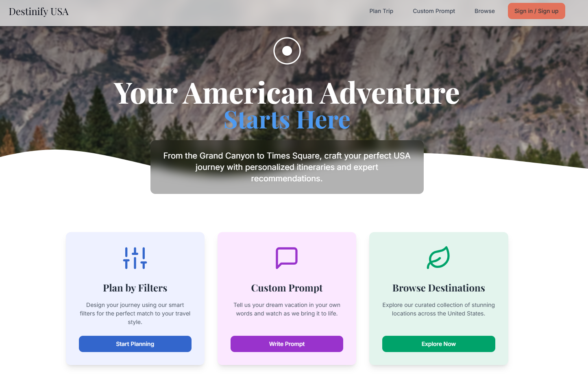
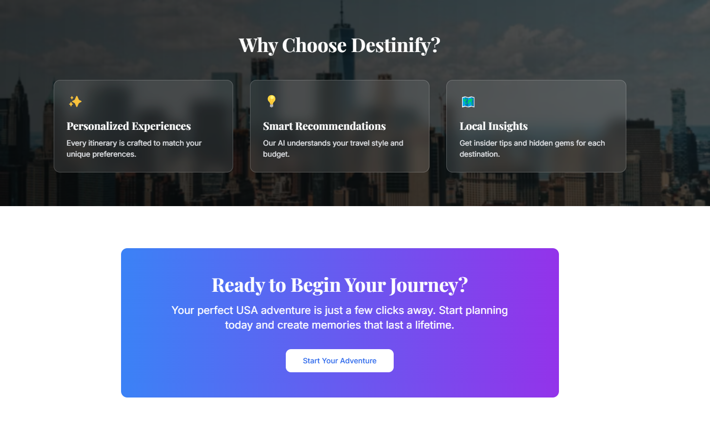

# Destinify

Destinify simplifies travel planning by creating customized itineraries for trips of any length—whether a weekend getaway or an extended vacation. Users can input their travel preferences and destinations, and Destinify generates a detailed plan with AI-driven suggestions. The app’s sleek design ensures an intuitive and enjoyable experience for all users.

## What the App Looks Like

Destinify features a clean and user-friendly interface. Below are placeholders for screenshots to showcase the app:

  


  


## Table of Contents

- [Project Summary](#project-summary)
- [Tech Stack](#tech-stack)
- [What the App Looks Like](#what-the-app-looks-like)
- [Running the Code Locally](#running-the-code-locally)
- [Obtaining an OpenAI API Key](#obtaining-an-openai-api-key)


## Tech Stack

This project is built with the following technologies:

- **[Vite](https://vitejs.dev/)** - A fast frontend build tool for modern web development.
- **[TypeScript](https://www.typescriptlang.org/)** - Adds static typing to JavaScript for improved code reliability.
- **[React](https://reactjs.org/)** - A JavaScript library for building dynamic user interfaces.
- **[shadcn-ui](https://shadcn.dev/)** - A customizable UI component library for rapid development.
- **[Tailwind CSS](https://tailwindcss.com/)** - A utility-first CSS framework for flexible and responsive styling.


## Running the Code Locally

Follow these steps to set up and run Destinify on your local machine:

1. **Clone the Repository**:
   ```bash
   git clone https://github.com/your-username/destinify.git
   cd destinify